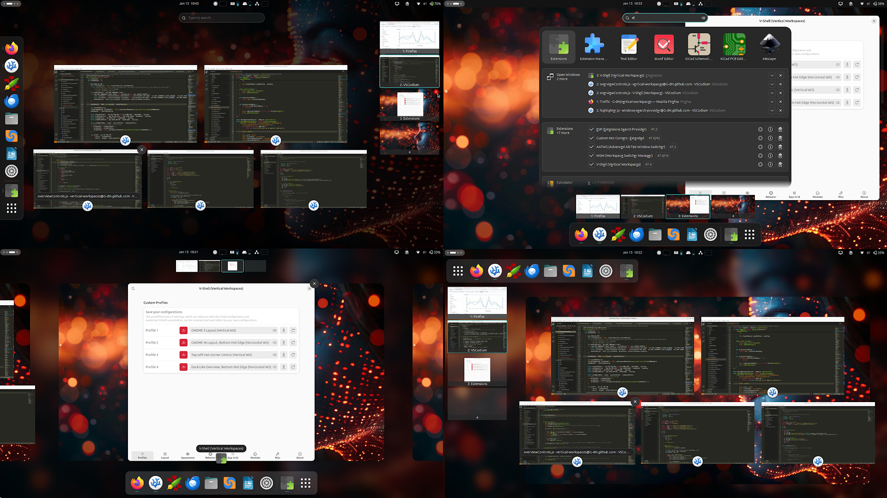
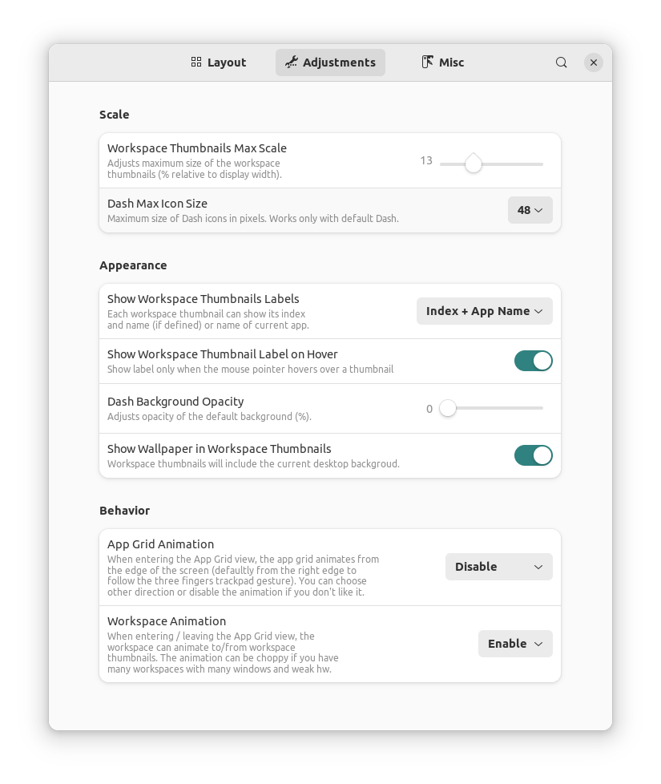
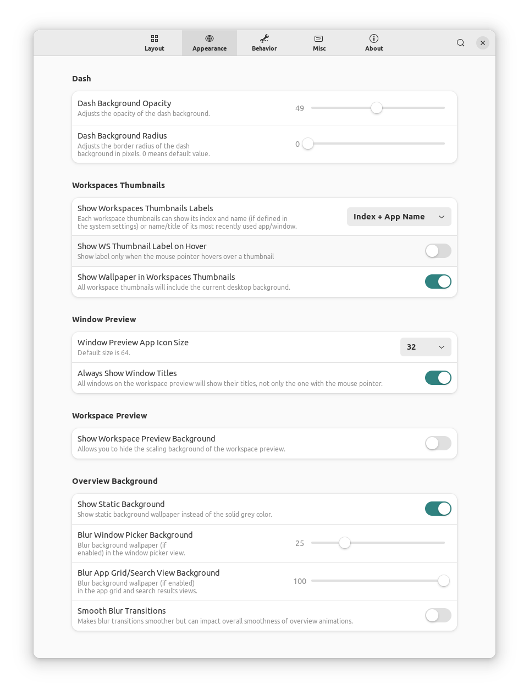

# Vertical Workspaces

GNOME Shell extension that changes the horizontal layout of workspaces to vertical and adds customization of the Activities overview layout. See options on screenshots below.
This extension does NOT offer vertical orientation of Dash but is compatible with *Dash to Dock* / *Ubuntu Dock* extensions and their forks, which support the vertical orientation.

Supported GNOME versions: 40, 41, 42.

## Installation

### Installation from extensions.gnome.org

The easiest way to install Vertical Workspaces: go to [extensions.gnome.org](https://extensions.gnome.org/extension/5177/vertical-workspaces/) and toggle the switch. This installation also gives you automatic updates in the future.

### Installation from GitHub repository
The most recent version in the repository is the one I'm currently using and developing on my own systems, problems may occure, but usually nothing serious.
You may need to install `git`, `gettext` and `glib2.0` for successful installation.
Navigate to the directory you want to download the source code and execute following commands in the terminal:

    git clone https://github.com/G-dH/vertical-workspaces.git
    cd vertical-workspaces/
    make install

### Enabling the extension
After installation you need to enable the extension and access its settings.

- First restart GNOME Shell (`ALt` + `F2`, `r`, `Enter`, or Log Out/Log In if you use Wayland)
- Now you should see *Vertical Workspaces* extension in *Extensions* application (re-open the app if needed to load new data), where you can enable it and access its Preferences window by pressing `Settings` button.

## Credits
This extension uses parts of the [Vertical Overview extension](https://github.com/RensAlthuis/vertical-overview).

## Buy me a coffe
If you like my extensions and want to keep me motivated, you can also buy me a coffee:
[buymeacoffee.com/georgdh](buymeacoffee.com/georgdh)
