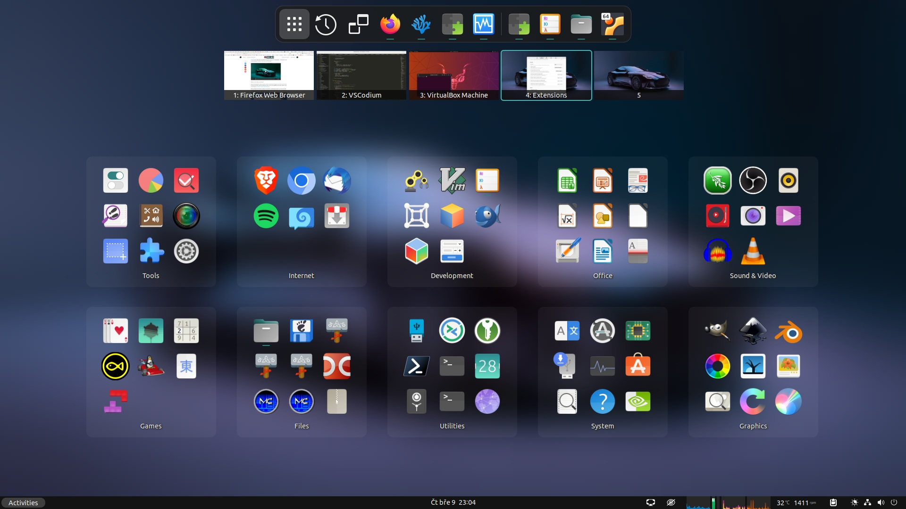

# V-Shell (Vertical Workspaces)

A GNOME Shell extension that lets you customize your GNOME Shell UX to suit your workflow, whether you like horizontally or vertically stacked workspaces.

Currently supported GNOME versions: 42 - 45

## Features
- Vertically or horizontally stacked workspaces
- Adjust position, orientation, scale and visibility of overview content
- Customizable profiles offer predefined configurations for GNOME 3.xx, GNOME 40+ and another 2 custom layouts
- 2 overview modes with static windows/workspace. The *Static Workspace* option allows you to use dash like a dock with auto-hide, but with all advantages of the activities overview
- Support for secondary monitors, workspace thumbnails can be placed on the opposite side than on the primary monitor
- Wallpaper background with adjustable blur effect and brightness in the overview
- Custom Dash icon size and on-click/scroll behavior
- Dash background transparency and corner radius adjustments
- Adjustable app grid icon size, number of columns and rows, content, optional active and draggable icons in folder preview in optional 3x3 grid
- Custom search view width, app results icons size and number of result lists rows, improved app search
- Workspace thumbnails can show background wallpaper and labels (always or on mouse hover) with combination of workspace index, workspace name, name of the current application and current window title
- Title captions of window previews moved into the preview (originally beneath the preview) and can be set as always visible. Adjustable window preview icon
- Static background in workspace switcher (outside overview). Keeps Conky below, DING desktop icons stay visible (if not covered by windows)
- Control over transition animations, including speed
- Window search provider with *Space* hotkey allows quick window navigation
- Recent files search provider with Ctrl + Space hotkey
- Reorder workspaces in overview using *Shift + Scroll* or *Shift + Page Up/Down*
- Adds *Force Quit*, *Close Windows on Current Workspace* and *Move Windows to Current Workspace* items to app icon menu. The latter action can be activated using *Shift + click* on app icon
- Change notification banners and OSD popups position
- Window attention handler options can activate the attention-demanding window immediately or silence its notification
- Optional position of the hot corner that can follow the dash and expand to hot edge
- Super key behavior options
- Window thumbnail (PIP) options allows you to create scaled down clone of the window by clicking on it's preview in the overview (secondary mouse buttons or window preview icon)

## Changelog
[CHANGELOG.md](CHANGELOG.md)

## Installation

### Installation from extensions.gnome.org
The easiest way to install the latest stable release of V-Shell: go to [extensions.gnome.org](https://extensions.gnome.org/extension/5177/vertical-workspaces/) and toggle the switch.

### Installation from the latest Github release
Download the latest release archive using following command:

    wget https://github.com/G-dH/vertical-workspaces/releases/latest/download/vertical-workspaces@G-dH.github.com.zip

Install the extension (`--force` switch needs to be used only if some version of the extension is already installed):

    gnome-extensions install --force vertical-workspaces@G-dH.github.com.zip

### Installation from GitHub repository
The most recent version in the repository is the one I'm currently using and developing on my own systems, problems may occur, but usually nothing serious. The repository version may change often and doesn't updates automatically on your system. If you want to help me, use this latest version and report bugs.
You may need to install `git`, `make`, `gettext` and `glib2.0` for successful installation.
Navigate to the directory you want to download the source code and execute following commands in the terminal:

GNOME 45:

    git clone https://github.com/G-dH/vertical-workspaces.git
    cd vertical-workspaces
    make install

GNOME 42 - 44:

    git clone https://github.com/G-dH/vertical-workspaces.git
    cd vertical-workspaces
    git checkout gnome-42-44
    make install

If you get `Can't recursively copy directory` error, take a look at issue #51.

### Enabling the extension
After installation you need to enable the extension and access its settings.

- First restart GNOME Shell (`ALt` + `F2`, `r`, `Enter`, or Log Out/Log In if you use Wayland)
- Now you should see *Vertical Workspaces* extension in *Extensions* application (re-open the app if needed to load new data), where you can enable it and access its Preferences window by pressing `Settings` button.

## Credits
This extension uses customized utils and dash modules of the [Vertical Overview extension](https://github.com/RensAlthuis/vertical-overview).

## Buy me a coffee
If you like my extensions and want to keep me motivated give me some useful feedback, but you can also help me with my coffee expenses:
[buymeacoffee.com/georgdh](https://buymeacoffee.com/georgdh)
