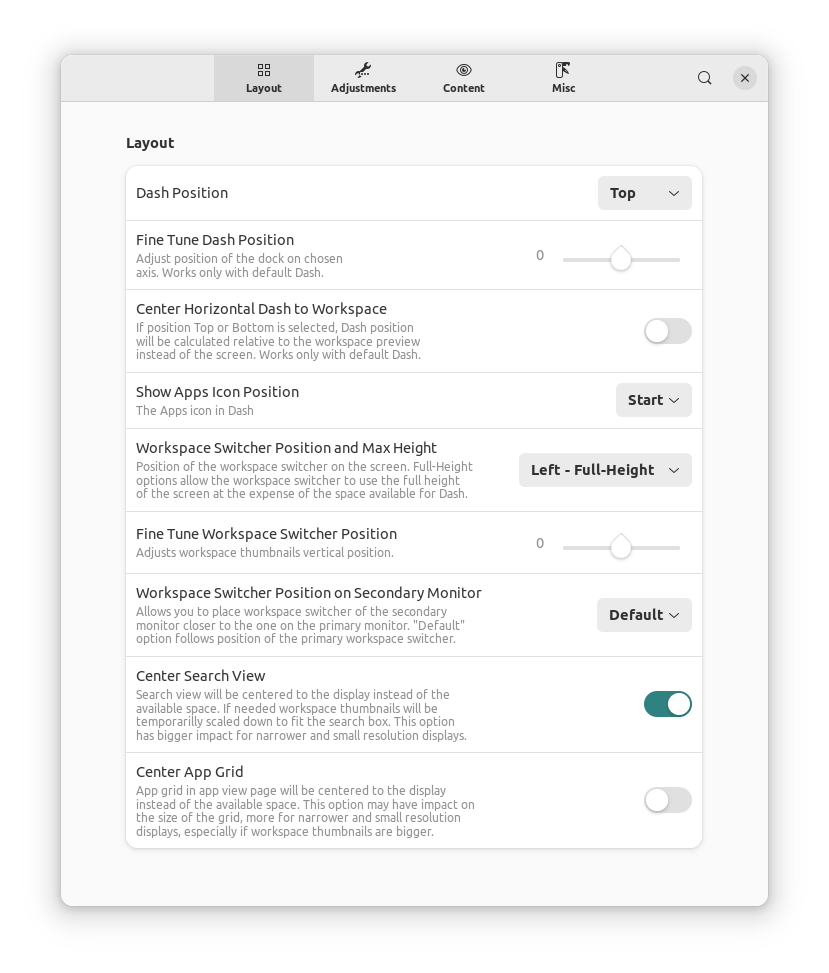
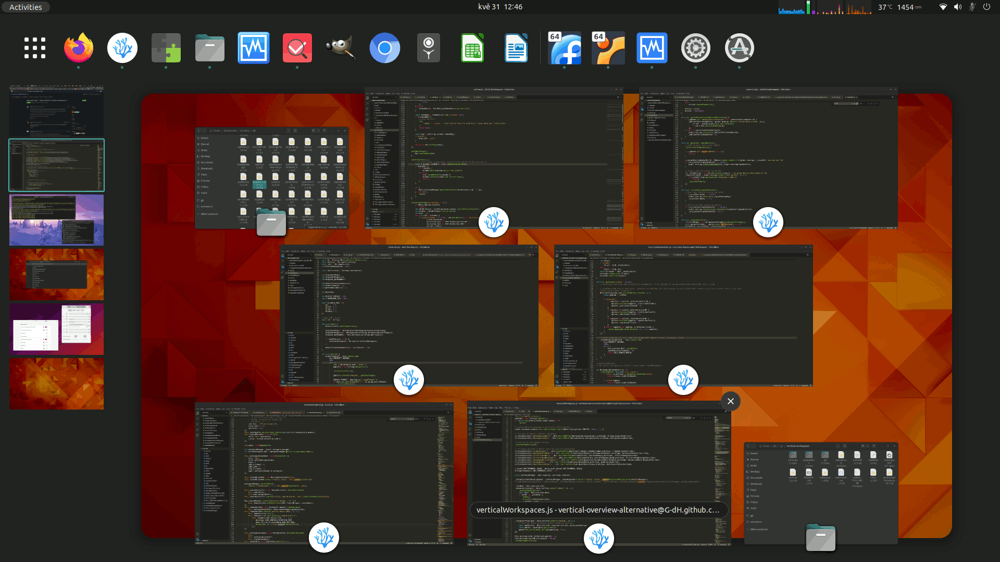

# Vertical Workspaces

GNOME Shell extension that changes horizontal layout of workspaces to vertical and adds customization of Activities Overview.

Supported GNOME versions: 41, 42.

## Installing from GitHub repository
The most recent version in the repository is the one I'm currently using on my own systems, problems may occure, but usually nothing serious.
You may need to install `gettext` for successful installation.
Navigate to the directory you want to download the source code and execute following commands in the terminal:

    git clone https://github.com/G-dH/vertical-workspaces.git
    cd vertical-workspaces/
    make install

## Enabling the extension
After installation you need to enable the extension and access its settings.

- First restart GNOME Shell (`ALt` + `F2`, `r`, `Enter`, or Log Out/Log In if you use Wayland)
- Now you should see *Vertical Workspaces* extension in *Extensions* application (re-open the app if needed to load new data), where you can enable it and access its Preferences window by pressing `Settings` button.
