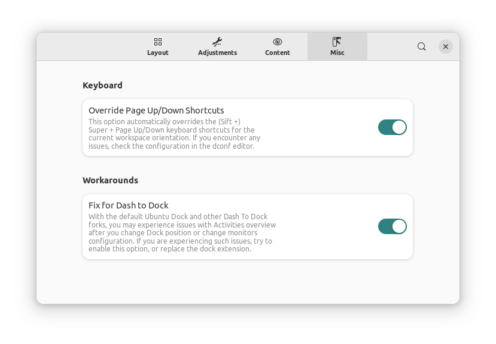
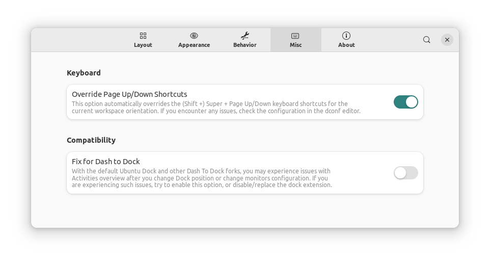
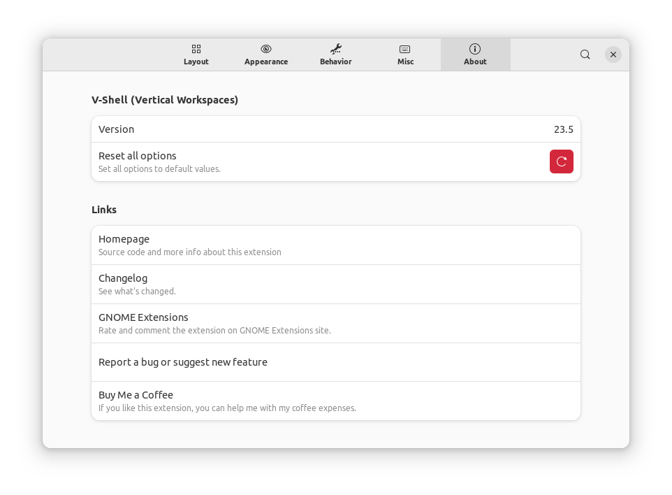

# V-Shell (former Vertical Workspaces)

A GNOME Shell extension that lets you customize your desktop interface to suit your workflow and style. You can change the horizontal stacking of workspaces to vertical, but also change layout, content, appearance and behavior of the Shell. Forget Dash to Dock and similar dock extensions, with V-Shell you don't need it, just use Static Workspace option.

Supported GNOME versions: 42, 43 (dropped support for 40, 41  - not tested).

## Features
- Vertically or horizontally stacked workspaces.
- Position, orientation, scale and visibility of the overview content.
- Support for secondary monitors, workspaces thumbnails can be placed on the opposite side relative to primary monitor. Removes unnecessary transitions.
- Static background with blur adjustments.
- 2 overview modes with static windows/workspace that expose windows on hover/click on workspace thumbnail. The *Static Workspace* option allows you to use dash like a dock with auto-hide but with all advantages of the activities overview.
- Custom dash icons size and behavior when clicked.
- Dash background transparency and corner radius adjustments.
- App grid icon size, number of columns and rows.
- Custom search view width, app results icons size and number of result lists rows.
- Workspace thumbnails can show background wallpaper and labels (always or on mouse hover) with combination of workspace index, workspace name, name of the current application and current window title.
- Title captions of window previews moves into the preview (originally beneath the preview) and can be set as always visible.
- Static background in workspace switcher (outside overview). Keeps Conky below, DING desktop icons stay visible (if not covered by windows).
- More efficient and visually appealing transition animations (compared to the original Shell) that can be customized or disabled.
- Animation/transition speed adjustment.
- Window search provider with *Space* hotkey allows quick window navigation.
- Recent files search provider with *Ctrl + Space* hotkey.
- Reorder workspaces in overview using *Shift + Scroll* or *Shift + Page Up/Down*
- Adds *Force Quit*, *Close Windows on Current Workspace* and *Move Windows to Current Workspace* items to app icon menu. The latter action can be activated using *Shift + click* on app icon.

## Installation

### Installation from extensions.gnome.org
The easiest way to install the latest stable release of V-Shell: go to [extensions.gnome.org](https://extensions.gnome.org/extension/5177/vertical-workspaces/) and toggle the switch.

### Installation from the latest Github release
Download the latest release archive using following command:

    wget https://github.com/G-dH/vertical-workspaces/releases/latest/download/vertical-workspaces@G-dH.github.com.zip

Install the extension (`--force` switch needs to be used only if some version of the extension is already installed):

    gnome-extensions install --force vertical-workspaces@G-dH.github.com.zip

### Installation from GitHub repository
The most recent version in the repository is the one I'm currently using and developing on my own systems, problems may occur, but usually nothing serious. The repository version may change often and doesn't updates automatically on your system, but once the stable release shows up on extensions.gnome.org, it should be updated automatically from there. If you want to help me, use this latest version and report bugs.
You may need to install `git`, `gettext` and `glib2.0` for successful installation.
Navigate to the directory you want to download the source code and execute following commands in the terminal:

    git clone https://github.com/G-dH/vertical-workspaces.git
    cd vertical-workspaces
    make install

### Enabling the extension
After installation you need to enable the extension and access its settings.

- First restart GNOME Shell (`ALt` + `F2`, `r`, `Enter`, or Log Out/Log In if you use Wayland)
- Now you should see *Vertical Workspaces* extension in *Extensions* application (re-open the app if needed to load new data), where you can enable it and access its Preferences window by pressing `Settings` button.

## Credits
This extension uses customized utils and dash modules of the [Vertical Overview extension](https://github.com/RensAlthuis/vertical-overview).

## Buy me a coffee
If you like my extensions and want to keep me motivated, you can also buy me a coffee:
[buymeacoffee.com/georgdh](https://buymeacoffee.com/georgdh)

